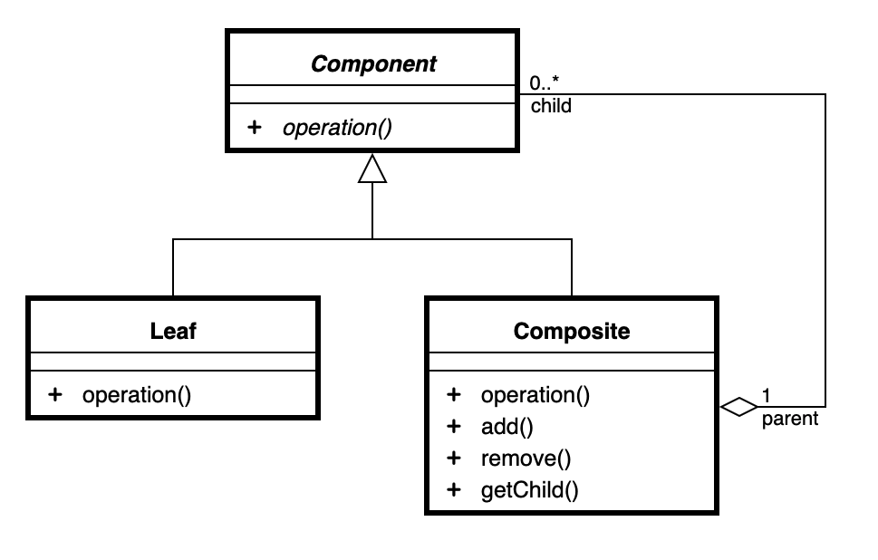

# Composite pattern examples
This project contains small examples of Composite design pattern implemented in **Java** and **Python**. 

## Composite pattern
In software engineering, the composite pattern is a partitioning design pattern. The composite pattern describes a group of objects that are treated the same way as a single instance of the same type of object. The intent of a composite is to "compose" objects into tree structures to represent part-whole hierarchies. Implementing the composite pattern lets clients treat individual objects and compositions uniformly [1].

Fig. 1 - UML class design

## Examples
- Example 1 in Java uses two objects, object **File** as Leaf, and object **Directory** as branch, and implements the composite pattern named **CompositeDemo** [3].
- Example 2 in Java uses three components, **Project**, **Deliverable**, and **Task**, forming a tree structure, where Projects and Tasks are branches, and Deliverables are Leafs. The output of the application lists the total amount of time needed, and details of all the items [3].
- Example 3 in Python composes objects into tree structures and then works with these structures as if they were individual objects [2].

## References
[1] - [Composite Pattern Wikipedia](https://en.wikipedia.org/wiki/Composite_pattern)\
[2] - SHVETS, Alexander. Dive Into Design Patterns. Refactoring. Guru, 2018.
\
[3] - [PPCU, Budapest. Design Patterns](http://ipcv.eu/blog/course/programming-methodology/)